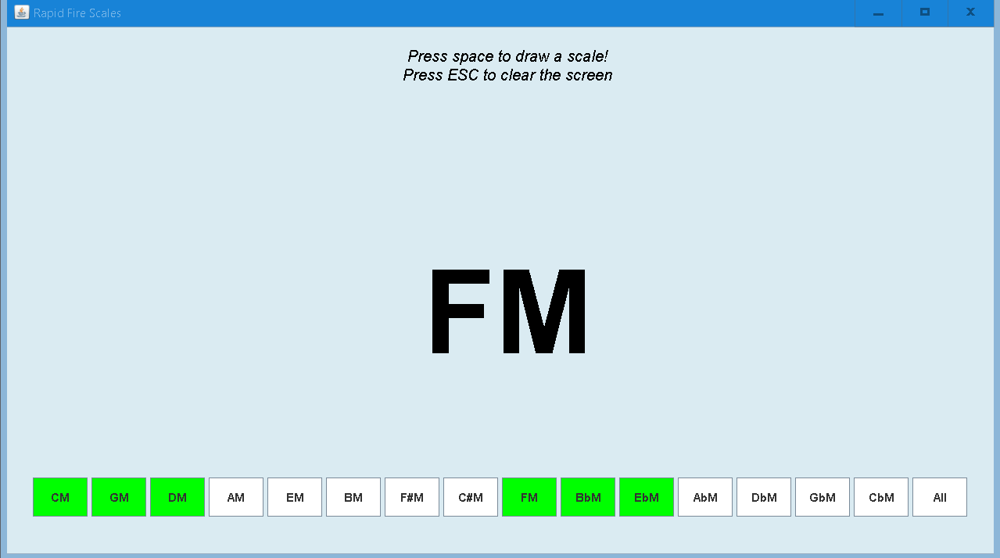

# Rapid-fire Scales
##### Applet for music teachers and AP® Music Theory teachers quizzing their students on scales.
</img>
### Usage
Ensure that the Java 8 JRE is installed.  
To download the latest version of Rapid-fire Scales, click on RapidFireScales.jar in the repository. 
Then, click the download button (in the middle-right of the screen), and execute the downloaded RapidFireScales.jar file.
### Disclaimer
AP® is trademarked by the College Board. This project is not affiliated with the College Board in any way. 
